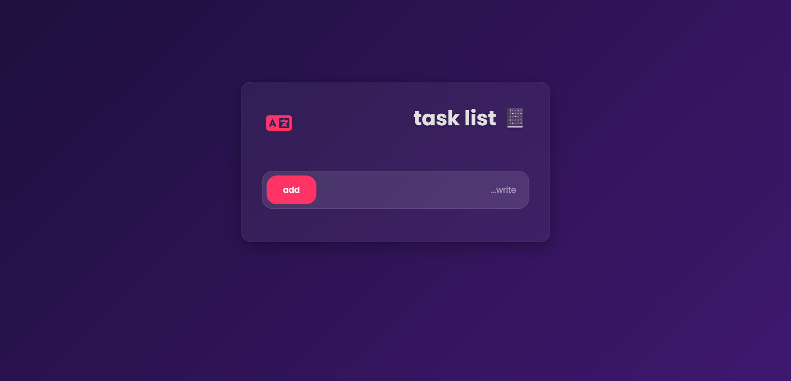

# To-Do List App ✨

A sleek front-end project crafted with love using HTML, CSS, and JS.

## 🚀 Live Demo

Experience the site live at 👉 [Click me](https://to-do-emadn87-dev.netlify.app)

## Demo Preview 📸

## Description 📝

A simple and stylish to-do list application that allows users to add, delete, and mark tasks as complete. It features a language toggle between English and Persian and saves tasks to your browser's local storage so you don't lose them.

## Features 🔥

| Feature | Description |
|---|---|
| Responsive Design | Works on mobile, tablet, desktop 💻📱 |
| Add & Remove Tasks | Easily add new tasks and remove them when they are no longer needed. |
| Mark as Completed | Click on a task to mark it as completed. |
| Local Storage | Your tasks are saved in your browser's local storage, so they will be there when you come back. |
| Language Switch | Toggle between English and Persian with the click of a button. |

## Tech Stack 🛠️

-   
-   
- 

## Installation 🚀

1.  Clone it: `git clone https://github.com/EmadN87-dev/to-do-app.git`
2.  Open `index.html` in browser. No dependencies needed\!

## Usage 🎮

Run locally or check the demo. Tweak in `styles.css` for fun.

## License ⚖️

MIT License - See [LICENSE](https://www.google.com/search?q=LICENSE) for details.
